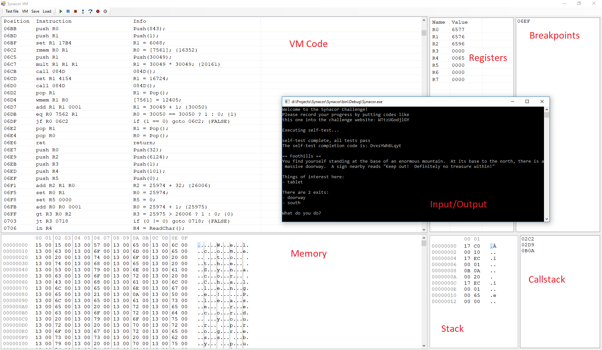

# The debugger for Synacor VM.
It was developed to solve the [Synacor Challenge](https://challenge.synacor.com) https://challenge.synacor.com

With the debugger you can:
* Run a bin file;
* Debug step-by-step and view the instruction result immediately;
* View memory, callstack, stack, registers;
* Setup breakpoints to execute/read/write.

## Debugger main window

